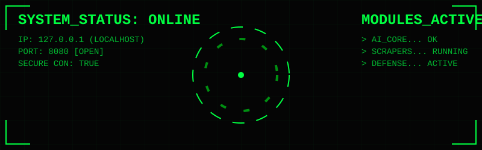

## About ME

[%2C+REST+APIs;->+AI%2FML%3A+LLMs%2C+NLP%2C+Model+Deployment;+->+Scraping%3A+BS4%2C+Selenium%2C+Data+Extraction;->+Security%3A+Ethical+Hacking%2C+Network+Sec;->+Full-Stack%3A+End-to-end+modern+solutions)](https://git.io/typing-svg)

## 🛠️ Technological Arsenal

| **Category** | **Technologies** |
|:------------:|:-----------------|
| **Languages** |      |
| **Frameworks** |      |
| **AI & Data** |      |
| **Agents & GenAI** |       |
| **Web Scraping** |       |
| **Databases** |    |
| **DevOps & Tools** |    |

  

## Let's Collaborate

## Connect With Me

<a href="mailto:pravin.prajapati0126@gmail.com" target="_blank">

</a>

